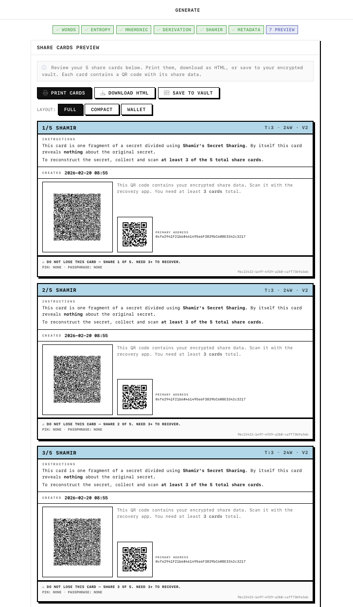

# n of m

Shamir's Secret Sharing for Seed Phrases. Split. Print. Recover.



## Overview

**n of m** splits BIP39 seed phrases into *m* Shamir shares where any *n* can reconstruct the original secret. Each share is encoded as a QR code on a printable card. No network requests. All cryptography runs in your browser.

## Features

- **Generate** - Create 12/15/18/21/24-word seed phrases with system CSPRNG or mouse entropy
- **Split** - Shamir's Secret Sharing over GF(2^8), configurable threshold and total shares
- **Print** - Full-page layout with 80% QR code size optimized for scannability
- **Export** - Multiple formats: HTML, PDF, and Vault Backup (HTML with embedded QR)
- **Scan** - Camera or file-based QR scanning with jsQR fallback for reliability
- **Vault** - AES-256-GCM encrypted IndexedDB storage with optional password protection
- **Derive** - BIP44 HD wallet address derivation (MetaMask, Ledger, custom paths)
- **Offline** - Fully client-side SPA, no server, no API calls

## Export Formats

### Share Cards
- **HTML**: Printable full-page cards with embedded QR codes (pre-rendered for offline use)
- **PDF**: Professional PDF documents with full-page layout, optimized for printing
- **Use**: Scan individual share cards during recovery to reconstruct your secret

### Vault Backup
- **Vault Backup HTML**: Complete backup document with embedded QR code, instructions, and security warnings
- **Contains**: Full seed phrase, all addresses, configuration, derivation path
- **Use**: Store separately from share cards as an additional backup layer
- **Note**: Cannot be scanned by share card scanner - use individual share cards for recovery

### Features
- All addresses included (not truncated)
- Date/time stamps on all exports
- Print-optimized CSS and formatting
- Security information and usage instructions
- QR codes optimized for scannability and print page fitting

## Cryptography

| Component | Implementation |
|-----------|---------------|
| Secret Sharing | Shamir's scheme over GF(2^8) finite field |
| Encryption | AES-256-GCM via `@noble/ciphers` |
| Key Derivation | PBKDF2-SHA256 (100k iterations) |
| Wallet Derivation | BIP39/BIP44 via `ethers.js` |
| Random | `crypto.getRandomValues()` CSPRNG |

## Tech Stack

- SvelteKit 2 + Svelte 5 (runes)
- TypeScript
- Vite 7
- `@sveltejs/adapter-static` (fully static SPA)
- QRious (QR generation)
- jsQR (QR scanning)

## Development

```bash
bun install
bun run dev        # dev server on :5173
bun run build      # production build to ./build
bun run preview    # preview production build
bun run test       # run unit tests
bun run check      # svelte-check type checking
```

## Security Model

- All operations are client-side. No data leaves the browser.
- Seed phrases and private keys exist only in memory during generation.
- Vault entries are encrypted with AES-256-GCM before storage in IndexedDB.
- Shamir shares individually reveal zero information about the secret.
- PIN protection adds an additional encryption layer to share data.

## License

MIT
